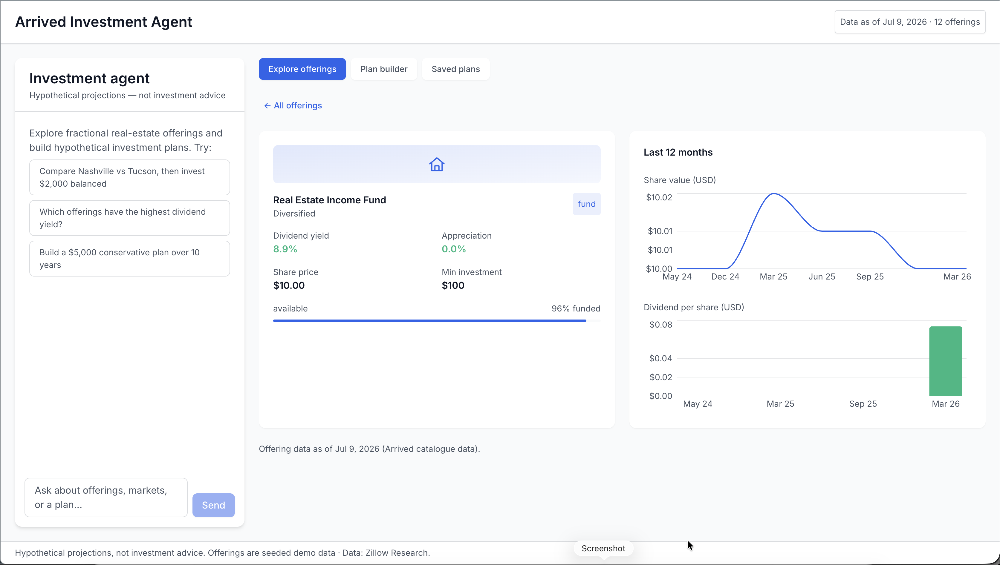
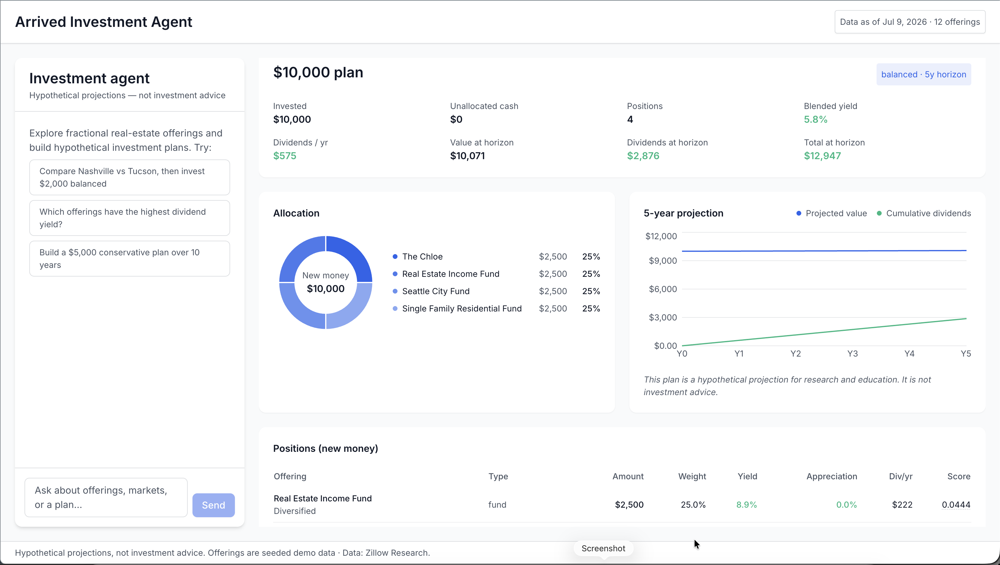

# Arrived Investment Agent

An AI-assisted explorer for fractional real-estate offerings, modeled on [Arrived](https://arrived.com). Chat with an agent about live offerings, compare markets, and build hypothetical investment plans — where every allocation comes from a **deterministic planning engine**, never from the model's imagination.

> **Educational / research tool.** Every plan is a hypothetical projection, not investment advice. This project is not affiliated with, endorsed by, or connected to Arrived Homes.



## What it does

- **Live offering data** — a manual "Refresh live data" action ingests currently-buyable listings (Available / New / Almost Gone) from Arrived's public catalogue JSON API. Fully-funded listings are excluded. Yields derive from real dividends, appreciation from real share-price history. No fake data: the app starts empty and only ever shows the real catalogue.
- **Chat agent** (Claude, via the Anthropic API) — answers questions about offerings and markets by calling typed tools. It never invents numbers or does allocation math; the UI renders each tool result as a rich component (cards, charts, plan views).
- **Deterministic planner** — pure-Python allocation engine: risk-profile score weights (yield, appreciation, market momentum, leverage penalty), per-position caps, market diversification limits, a vacation-rental share cap, and a fund floor. Same inputs → byte-identical plan, always. Every position carries a score breakdown so "why is X ranked above Y?" has a data answer.
- **Three ways to build a plan** — the form (amount / risk / horizon), a natural-language goal box ("$5k for steady income, fairly cautious, ~5 years" → the AI picks parameters and calls the engine), or just asking in chat.
- **Plan attachments** — attach a saved plan to the chat (📎 in the composer, or "Discuss in chat" on any saved plan) and ask questions about it or request changes; the agent rebuilds from the plan's exact inputs and offers to save the result as a new snapshot.
- **Immutable snapshots + compare** — saved plans capture inputs, full output, and data freshness; later data refreshes never mutate them. A compare view renders two snapshots side by side.
- **Market enrichment** — Zillow Research home-value/rent indexes (no key needed), FRED unemployment and Census demographics (optional keys) feed a bounded "momentum" tilt in scoring — never a gate.



## Stack

| Layer | Tech |
|---|---|
| Backend | Python 3.12 · FastAPI · DuckDB · Anthropic SDK (async, SSE streaming) · httpx · pydantic v2 |
| Frontend | React 18 · TypeScript (strict) · Vite · Tailwind CSS · Recharts · Zustand |
| Infra | Docker multi-stage builds · docker-compose · nginx |

Architecture is ports-and-adapters: a pure domain core (models, risk strategies, allocation engine, market math), services depending only on protocol ports, and adapters (DuckDB repositories, Anthropic client, data fetchers) wired in a single composition root.

## Quick start

```bash
# Full stack: web on http://localhost:5173, API on http://localhost:8000
docker compose up --build
```

This runs a **hot-reload** stack by default (via `docker-compose.override.yml`): source is bind-mounted, so editing a backend `.py` reloads uvicorn and editing a frontend `.tsx` hot-swaps in the browser — no rebuild. For the production-parity stack (baked build, nginx, no mounts) bypass the override:

```bash
docker compose -f docker-compose.yml up --build   # or: make up-prod
```

Then open the app and click **Refresh live data** on the Explore tab to load the current Arrived catalogue. Everything except the chat works without any API key.

To enable the chat agent, put your key in `backend/.env` (see `backend/.env.example`):

```
ANTHROPIC_API_KEY=sk-ant-...
```

### Local development

```bash
make install     # uv sync + npm install
make dev-api     # FastAPI with reload on :8000
make dev-web     # Vite dev server on :5173
make help        # all targets
```

### Quality gates

```bash
make verify      # ruff + mypy + pytest (backend), tsc + vitest + build (frontend)
```

The backend suite runs fully offline — external fetchers are tested against mocked transports, and the planner's invariants (budget conservation, caps, determinism) are pinned by tests.

## Configuration

| Variable | Default | Notes |
|---|---|---|
| `ANTHROPIC_API_KEY` | — | required for chat only |
| `ANTHROPIC_MODEL` | `claude-sonnet-5` | chat model |
| `ARRIVED_API_URL` | `https://abacus.arrivedhomes.com` | public catalogue source (no key) |
| `FRED_API_KEY` / `CENSUS_API_KEY` | — | optional enrichment; skipped cleanly when absent |
| `ZILLOW_ZHVI_URL` / `ZILLOW_ZORI_URL` | Zillow Research CSVs | overridable for pinning/testing |
| `DB_PATH` | `data/arrived.duckdb` | persisted via a compose volume |

## Data sources & fair use

- **Arrived public catalogue** — fetched politely (one catalogue request plus one share-price request per buyable offering, only when you click refresh; permitted by robots.txt). This project stores a small derived snapshot for personal research.
- **Zillow Research** — home value (ZHVI) and rent (ZORI) indexes. Data: Zillow Research.
- **FRED / U.S. Census ACS** — optional metro unemployment and demographics.

## Disclaimer

All projections are hypothetical, for research and education only. Nothing here is financial, investment, tax, or legal advice. Do your own research. Not affiliated with Arrived Homes, Zillow, or any data provider.
